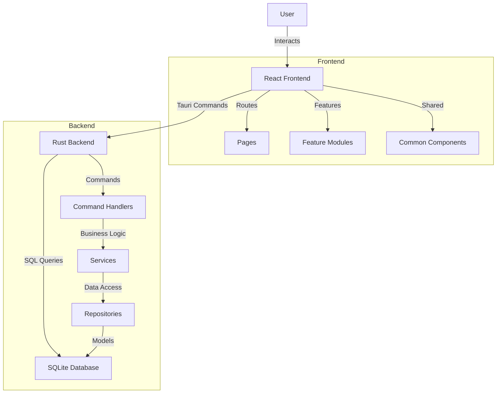
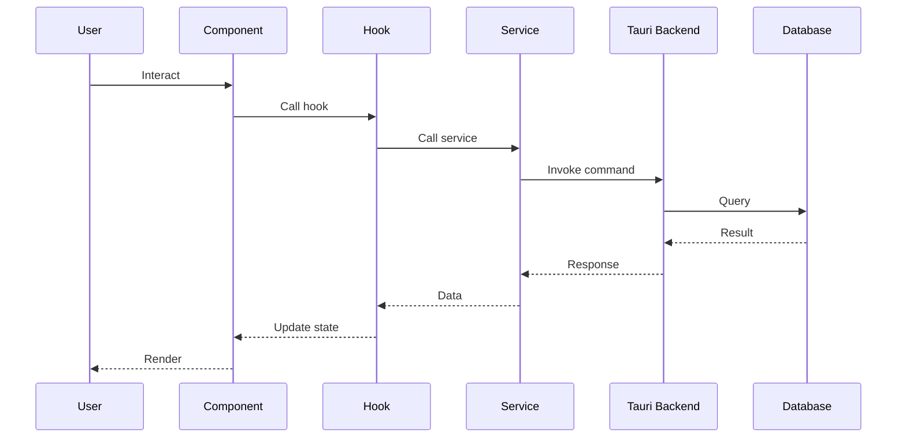

# Navin Architecture

## System Overview

Navin is a developer checklist management application built with a clear separation between frontend and backend:

- **Frontend**: React + TypeScript + Tailwind CSS
- **Backend**: Rust + Tauri + SQLite
- **Communication**: Tauri commands (IPC)

## Architecture Diagram



## Frontend Architecture

### Feature-Based Structure

The frontend follows a **feature-based architecture** where code is organized by business domain rather than technical layer:

```
src/
├── app/                  # Application root
│   ├── providers/        # React Context Providers
│   └── router/           # Route configuration
├── features/             # Feature modules
│   ├── checklist/
│   ├── projects/
│   └── settings/
├── common/               # Shared across features
│   ├── components/       # Reusable UI components
│   ├── hooks/            # Custom React hooks
│   ├── utils/            # Utility functions
│   └── constants/        # App constants
├── layouts/              # Layout components
└── pages/                # Top-level pages
```

### Feature Module Structure

Each feature follows a consistent internal structure:

```
features/[feature-name]/
├── components/          # Feature-specific components
├── hooks/               # Feature-specific hooks
├── services/            # API/Tauri communication
├── types/               # TypeScript types
├── pages/               # Feature pages
└── index.ts             # Public exports
```

**Benefits**:

- High cohesion: Related code stays together
- Easy to locate code by feature
- Scalable: New features don't clutter existing structure
- Testable: Each feature can be tested in isolation

### Data Flow



## Backend Architecture

### Layered Architecture

The Rust backend follows a **layered architecture** with clear separation of concerns:

```
src-tauri/src/
├── commands/           # Tauri command handlers (API layer)
├── services/           # Business logic layer
├── repositories/       # Data access layer
├── models/             # Domain models
├── database/           # Database connection & migrations
└── core/               # Core utilities (errors, types)
```

### Layer Responsibilities

1. **Commands** (`commands/`)
   - Entry points for frontend calls
   - Input validation
   - Error handling
   - Delegates to services

2. **Services** (`services/`)
   - Business logic
   - Orchestrates multiple repositories
   - Transaction management (future)

3. **Repositories** (`repositories/`)
   - Direct database access
   - SQL queries
   - Data mapping (DB ↔ Models)

4. **Models** (`models/`)
   - Domain entities
   - Serialization/Deserialization

### Command Flow

```
Frontend
   ↓ invoke("create_project", {name, description})
Commands Layer
   ↓ create_project(app, name, description)
Services Layer (future)
   ↓ ProjectService::create(...)
Repository Layer
   ↓ ProjectRepository::create_project(conn, ...)
Database
   ↓ INSERT INTO projects...
```

## Database Schema

### Core Tables

**projects**

- `id` (TEXT, PRIMARY KEY)
- `name` (TEXT)
- `description` (TEXT, nullable)
- `is_current` (BOOLEAN)
- `created_at` (DATETIME)

**checklist_sections**

- `id` (TEXT, PRIMARY KEY)
- `project_id` (TEXT, FOREIGN KEY)
- `title` (TEXT)
- `display_order` (INTEGER)

**checklist_items**

- `id` (TEXT, PRIMARY KEY)
- `section_id` (TEXT, FOREIGN KEY)
- `text` (TEXT)
- `display_order` (INTEGER)

**user_progress**

- `item_id` (TEXT, FOREIGN KEY)
- `project_id` (TEXT, FOREIGN KEY)
- `is_checked` (BOOLEAN)
- `checked_at` (DATETIME)

## Key Design Decisions

### Why Feature-Based (Frontend)?

Traditional layer-based organization (`components/`, `hooks/`, `services/`) becomes unwieldy as apps grow. Feature-based keeps related code together, making it easier to:

- Find code (by feature, not by type)
- Remove features (delete one folder)
- Parallelize development (teams own features)

### Why Tauri Over Electron?

- **Smaller bundle size**: 3-5 MB vs 50+ MB
- **Better performance**: Native Rust backend
- **Lower memory usage**: No embedded Chromium
- **Better security**: Process separation, no Node.js in renderer

### Why SQLite?

- **No setup required**: Embedded database
- **Reliable**: ACID compliant
- **Fast**: Local file access
- **Portable**: Single file database

## Performance Considerations

### Frontend Optimizations

1. **Code Splitting**: Routes lazy-loaded
2. **React.memo**: Prevent unnecessary re-renders
3. **useMemo/useCallback**: Memoize expensive computations
4. **Virtual Scrolling**: For long lists (future)

### Backend Optimizations

1. **Database Indexing**: On frequently queried columns
2. **Prepared Statements**: Reuse query plans
3. **Connection Pooling**: Reuse database connections (future)

## Security

### Frontend

- No sensitive data stored in localStorage
- All data access through Tauri commands
- XSS protection via React's escaping

### Backend

- SQL injection prevention via parameterized queries
- No eval() or dynamic SQL
- Tauri's allowlist restricts available commands

## Future Enhancements

1. **Cloud Sync**: Optional cloud backup
2. **Team Collaboration**: Share checklists
3. **Custom Templates**: User-defined checklist templates
4. **Analytics**: Progress tracking over time
5. **Plugins**: Extensibility via plugins

## File Size Guidelines

**Maximum Lines Per File**: 300

- Enforced by ESLint
- Encourages modular code
- Easier code review

When a file exceeds 300 lines:

- Extract components
- Split into multiple hooks
- Create sub-modules

## Testing Strategy

### Frontend

- Unit tests: `vitest`
- Component tests: `@testing-library/react`
- E2E tests: `playwright` (future)

### Backend

- Unit tests: `#[cfg(test)]` modules
- Integration tests: `tests/` directory

## Deployment

### Development

```bash
npm run tauri dev
```

### Production

```bash
npm run tauri build
```

Outputs platform-specific installers in `src-tauri/target/release/bundle/`

---

For API documentation, see [API.md](./API.md)
For setup instructions, see [SETUP.md](./SETUP.md)
